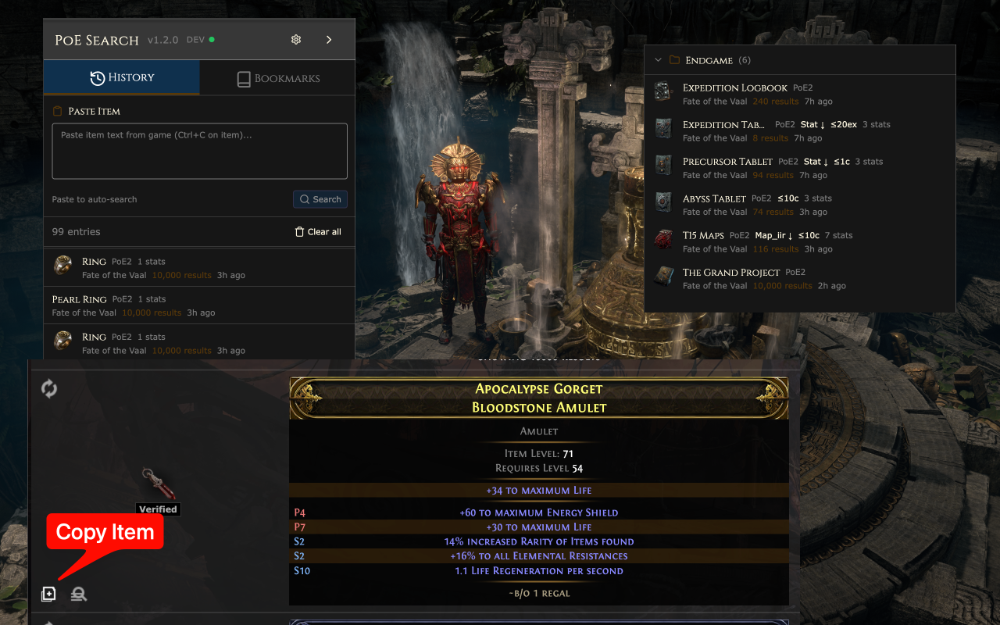

# PoE Item Search

Paste your item from ingame into the input field and press enter to search for it

## Installation

- Download ZIP from Repo and extract (click on the green Code button on the top right)
- Open Chrome and go to chrome://extensions
- Click "Load unpacked"
- Select the folder you extracted
- Visit https://www.pathofexile.com/trade or https://www.pathofexile.com/trade2 and paste an item into the search field

## TODOs

- Add support for implicit attributes
- Add support for item classes
- Add support for other languages than English
- Add support for other items like coins, gems, etc.

## Known issues

## Contributing

Contributions are welcome! Please feel free to submit a Pull Request

## License

[MIT License](LICENSE)