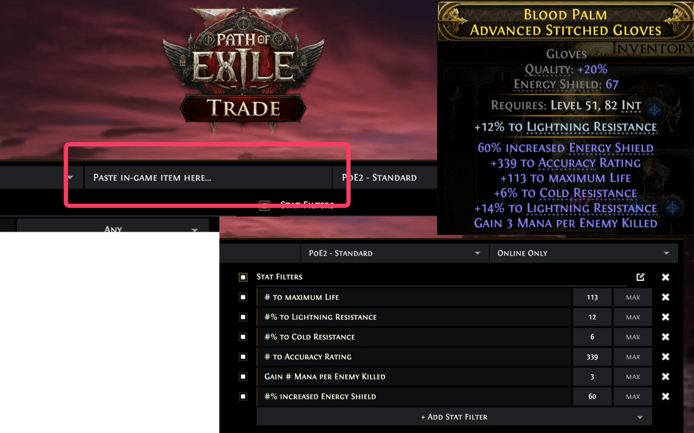

# PoE Item Search

A Chrome extension for Path of Exile 2 that enhances the official trade website with search history, bookmarks, and the ability to paste in-game item text directly to search.

## Features

### Paste Item Text to Search
Copy any item in-game with `Ctrl+C` and paste directly into the extension panel. The item text is automatically parsed and converted into a trade search query - no manual filter setup required.

### Search History
Every search you make (including ones using the native trade site UI) is automatically tracked. Re-run any previous search with one click.

### Bookmarks with Folders
Save important searches into organized folders. Archive old folders to keep things tidy without losing them.

### Persistent Sort Order
When you save a bookmark, the sort order is preserved. Re-running a bookmarked search restores the exact sorting you had - no more losing your "sort by DPS" after reloading.

### Item Preview Images
History entries and bookmarks show a small preview image of the first item from results, making it easier to identify searches at a glance.

### Copy Item Text from Results
Copy buttons on search results let you copy the full item text, useful for sharing items or re-searching with modifications. Also useful when importing an item to PoB.

## Installation

### Chrome Web Store (Recommended)
Install directly from the [Chrome Web Store](https://chromewebstore.google.com/detail/poe-item-search/llckjinbnppadklomlhedpmllfjhjklh)

### Manual Installation
1. Download the ZIP from this repo (click the green "Code" button, then "Download ZIP")
2. Extract the contents
3. Open Chrome and navigate to `chrome://extensions`
4. Enable "Developer mode" in the top right
5. Click "Load unpacked" and select the extracted folder
6. Visit [pathofexile.com/trade](https://www.pathofexile.com/trade) or [pathofexile.com/trade2](https://www.pathofexile.com/trade2)

## Usage

1. Open the PoE trade website (trade or trade2)
2. The extension panel appears on the right side of the page
3. To search by item text: copy an item in-game (`Ctrl+C` while hovering), then paste into the extension's paste input
4. Your search history appears automatically as you search
5. Click the bookmark icon on any history entry to save it to a folder

## Compatibility

- Works on both `pathofexile.com/trade` (PoE 1) and `pathofexile.com/trade2` (PoE 2)
- Chrome and Chromium-based browsers (Edge, Brave, etc.)

## Attribution

This project was inspired by [better-trading](https://github.com/exile-center/better-trading), an excellent trade companion for Path of Exile. Key differences from better-trading:

## Contributing

Contributions are welcome! Please feel free to submit a Pull Request.

## License

[MIT License](LICENSE)
